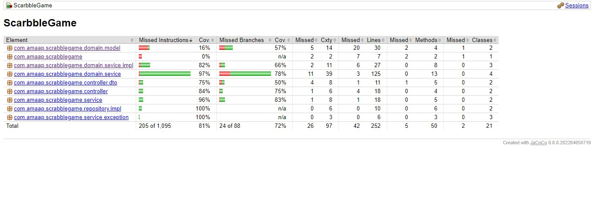

#Problem Statement:

Scrabble

Scrabble, this is a game where players attempt to create words from a set of letter tiles. Different letters have different points allocated to them.
In the English alphabet, letters have the following point scores:
Point(s)	Letter(s)
1			E, A, I, O, N, R, T, L, S, U
2			D, G
3			B, C, M, P
4			F, H, V, W, Y
5			K
8			J, X
10			Q, Z

Calculate the score for a word. The score is the sum of the points for the letters that make up a word.
For example: GUARDIAN = 2 + 1 + 1 + 1 + 2 + 1 + 1 + 1 = 10.
Extensions -

- double or triple a letter
- double or triple a word

Jacoco Report:

####  As this code is completely based on user interaction ant its outcome and it also has some random letter generation so at some places you will find the statically given code as input, it is done because we can not test the runtime behaviour and randomeness  of the outcome.

# Design Analysis:
## Controller

### PlayerController
- `createPlayer(id, name)`: Creates a player entity with the specified ID and name.

### GameController
- `startGame(playerId)`: Starts a game with the specified player entity.

## OuterService
### PlayerService
- `createPlayer(id, name)`: Service responsible for creating player entities.
### GameService
- `getScrabbleScore(word)`: Service responsible for calculating the score of a word in Scrabble.

## Domain
#### Model
##### LetterPointAllocator
- `getPoint(char c)`: Model class responsible for providing the point value of a Scrabble letter.

#### RackGenerator
- `assignRackWithLettersTo(playerId)`: Service responsible for assigning a rack with letter tiles to a player entity.

## Inner Service
#### GameInitializerService: This class is responsible for assigning an rack and initialize the game.
   
#### PlayGameService :This is responsible for starting the game.

#### ScoringService :This is responsible to deligate the  calculations.

#### PlayerInteractionService :Used for taking user inputs.

#### SrabbleCalculatorService :Interface that is used to  write the business logic of calculating score.

### Entities
- **Player**: Represents a player participating in the game.
- **Game**: Represents a game instance.

### Value Objects
- **ScrabbleLetterPoints**: Represents a letter tile with a character and point value.
- **RackGenerator**: Used to generate an set of tile to create word out of it .

## Assumption

- In the general Scrabble game, players can create words only using letter tiles present in their rack, with a limit of 7 letter tiles per rack. However, in this problem statement, there is  limit of maximum 15 letters  on the number of letter tiles in the rack.

## Future Modification
- we can make use design pattern like chain of responsibility in playService class.

## Outcome 
- Enter Number of players for Scrabble Game (max 4 min 1):
- 2
- Player ID: 1, Tiles: OBNUXTV
- Enter a word using the letters in the rack:
- box
- Current Score: 12
- Do you want to Double an letter? (yes/no)
- Enter the letter to double..
- o
- Current Score: 14
- Do you want to Double an word? (yes/no)
- Current Score: 26
- Do you want to Triple an letter? (yes/no)
- Enter the letter to triple..
- o
- Current Score: 29
- Do you want to Triple an word? (yes/no)
- no
- Remaining letters in the rack: NUTV
- Player ID: 2, Tiles: GRTKORE
- Enter a word using the letters in the rack:
- got
- Current Score: 4
- Do you want to Double an letter? (yes/no)
- Enter the letter to double..
- g
- Current Score: 8
- Do you want to Double an word? (yes/no)
- Current Score: 12
- Do you want to Triple an letter? (yes/no)
- Enter the letter to triple..
- o
- Current Score: 15
- Do you want to Triple an word? (yes/no)
- no
- Remaining letters in the rack: RKRE
- Player 1 Score: 29
- Player 2 Score: 23
- Do you want to continue playing? (yes/no):
- no
- Player 1 is the winner with the highest score: 29
