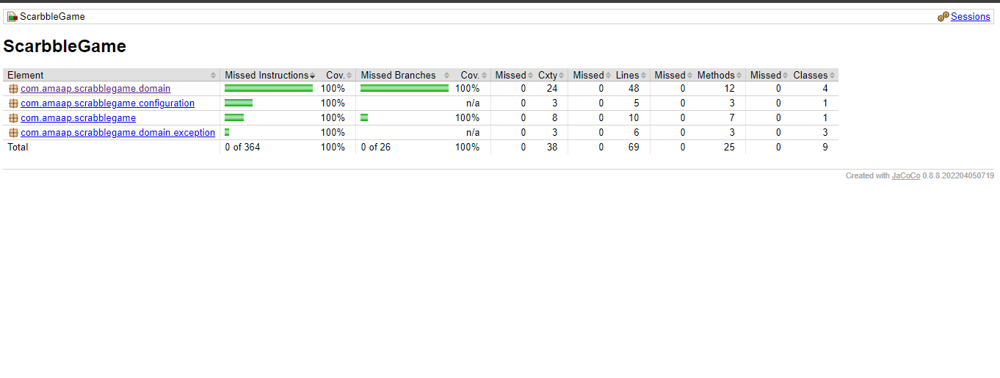

# SCRABBLE GAME

## States:
- `letters`: An array of strings 
- `points`: An array of integers
- `input`: A string 
- `sum`: An integer 

## Behaviors:
- `validator()`: Public method
- `getScore()`: Public method
- `calculateForLetter()`: public method
- `calculateForWord()`: public method
- 
### Classes:
- `PointAllocator`: Public class
- `Operations`: Public class
- `DoubleCalculator`: Public class (Inherited from `Operations`)
- `TripleCalculator`: Public class (Inherited from `Operations`)
- `Validator`: public class 
- `SrabbleSimulator`:public class
